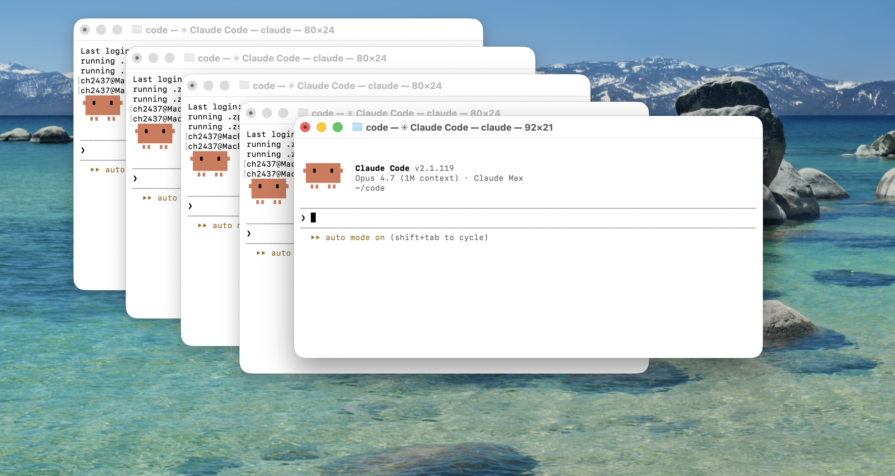

# Managing Non-Determinism in AI Coding Agents

## Overview

AI coding agents are highly effective at accelerating implementation, but they are not deterministic systems. Over longer workflows, they tend to lose coherence, reintroduce errors, and drift from intended behavior.

This repository describes a practical control architecture for working with such systems reliably.

---

## Core Insight

The main failure mode is not at the level of single prompts or global configuration, but at the level of **multi-step tasks**.

Tasks that span multiple plan–implement–revise cycles lose coherence over time due to context decay.

---

## Practical Control Architecture

To address this, the system introduces an explicit separation of state into three layers:

### 1. Global Rules

Project-wide constraints that define invariants, such as:

- no silent fallbacks
- no code duplication
- explicit failure on invalid assumptions
- verification of behavior, not plausibility

These reduce common errors but do not preserve long-horizon coherence.

---

### 2. Task Memory (Key Idea)

Each non-trivial task maintains a lightweight, persistent state:

- current objective
- decisions made
- completed steps
- open questions

This acts as a **continuity layer across agent iterations**, preventing context loss between plan–execution cycles.

It is the central mechanism that maintains coherence over time.

---

### 3. Change Artifacts

Two complementary logs:

- **Changelog**: records what changed and why
- **Design decisions**: records stable architectural choices

These provide durable reasoning context beyond transient prompts.

---

## Key Result

By externalizing task-level state, we:

- reduce context drift
- maintain coherence across long workflows
- improve reliability of multi-step agent execution

---

## Guiding Principle

> Global rules constrain behavior. Task memory preserves continuity.

Together, they form a minimal control architecture for non-deterministic coding agents.